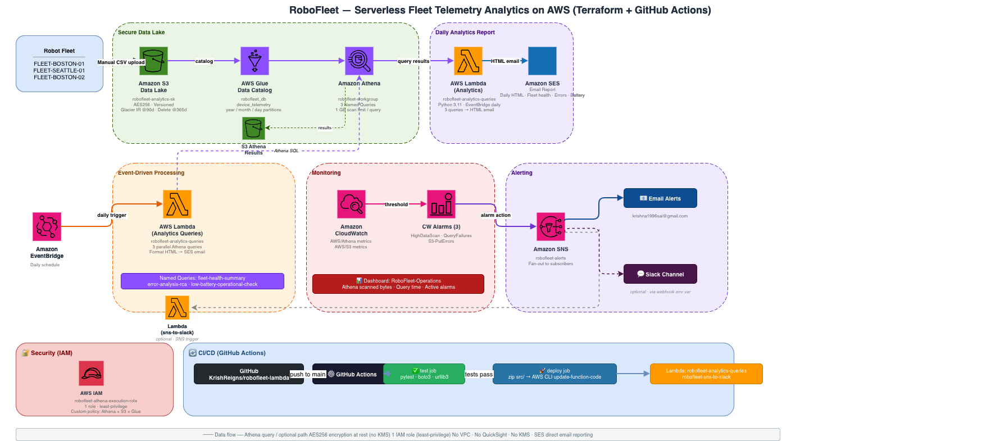

# RoboFleet Lambda - Project Documentation

## What This Project Is

A serverless robotics fleet analytics system built on AWS. It ingests device telemetry CSV data into S3, catalogs it with Glue, queries it with Athena, and sends alerts via SNS/SES. Infrastructure is managed with Terraform. The analytics Lambda runs daily and emails a formatted HTML report.

**IaC Tool:** Terraform  
**Language:** Python 3.11  
**Region:** us-east-1  
**Account:** 235695894002  

---

## Architecture Diagram



> To edit the diagram, open [diagrams.net](https://app.diagrams.net) and import `docs/architecture-visual.drawio`.

---

## AWS Resources Inventory

### Managed by Terraform

| Service | Resource Name | Purpose |
|---|---|---|
| S3 | `robofleet-analytics-sk` | Data lake — raw telemetry CSVs |
| S3 | `robofleet-athena-results-sk` | Athena query result outputs |
| Glue | `robofleet_db` | Glue catalog database |
| Glue | `device_telemetry` | External table over S3 data |
| Athena | `robofleet-workgroup` | Query execution workgroup |
| Athena | `fleet-health-summary` | Saved named query |
| Athena | `error-analysis-rca` | Saved named query |
| Athena | `low-battery-operational-check` | Saved named query |
| IAM Role | `robofleet-athena-execution-role` | Lambda execution role |
| IAM Policy | `robofleet-athena-s3-access` | Least-privilege Athena+S3 policy |
| SNS | `robofleet-alerts` | Alert notification topic |
| SNS Subscription | email → `krishna1996sai@gmail.com` | Alert delivery (pending confirmation) |
| CloudWatch Alarm | `RoboFleet-Athena-HighDataScan` | Fires if query scans >100MB |
| CloudWatch Alarm | `RoboFleet-Athena-QueryFailures` | Fires on query failures |
| CloudWatch Alarm | `RoboFleet-S3-PutErrors` | Fires on S3 write errors |
| CloudWatch Dashboard | `RoboFleet-Operations` | Ops visibility dashboard |

### Managed manually / outside Terraform

| Service | Resource Name | Purpose |
|---|---|---|
| Lambda | `robofleet-analytics-queries` | Daily analytics runner (deployed via GitHub Actions) |
| Lambda | `robofleet-sns-to-slack` (old) | SNS → Slack (from earlier iteration) |

---

## Data Schema

**Table:** `device_telemetry`  
**Location:** `s3://robofleet-analytics-sk/raw/device_telemetry/`  
**Format:** CSV with header row (`skip.header.line.count=1`)

| Column | Type | Description |
|---|---|---|
| `device_id` | string | Robot identifier e.g. `ROBOT-0001` |
| `fleet_id` | string | Fleet grouping e.g. `FLEET-BOSTON-01` |
| `event_time` | timestamp | UTC event timestamp |
| `battery_level` | int | Battery % (0-100) |
| `speed_mps` | double | Speed in m/s |
| `status` | string | `ACTIVE`, `IDLE`, `ERROR`, `CHARGING` |
| `error_code` | string | Error code if status=ERROR |
| `location_zone` | string | Zone e.g. `ZONE-A` |
| `temperature_celsius` | double | Device temperature |
| `year` *(partition)* | string | e.g. `2026` |
| `month` *(partition)* | string | e.g. `03` |
| `day` *(partition)* | string | e.g. `20` |

---

## Lambda Functions

### `robofleet-analytics-queries` (`src/lambda_robofleet_queries.py`)
- Trigger: EventBridge daily schedule
- Runs 3 Athena queries in parallel:
  1. Fleet Health Summary — event counts, avg battery, avg speed per fleet
  2. Error Analysis (RCA) — error frequency by device and error code
  3. Low Battery Alert — robots with battery <20% not charging
- Formats results as HTML tables
- Sends via SES to `krishna1996sai@gmail.com`
- Role: `robofleet-athena-execution-role`
- Workgroup: `robofleet-workgroup`

### `lambda_function.py` (`src/lambda_function.py`)
- SNS → Slack forwarder
- Triggered by SNS topic
- Formats CloudWatch alarm as Slack attachment message
- Reads `SLACK_WEBHOOK_URL` from environment variable

---

## Project Structure

```
robofleet-lambda/
├── .github/
│   └── workflows/
│       └── deploy.yml          # CI/CD: test → zip → deploy to Lambda
├── src/
│   ├── lambda_robofleet_queries.py   # Main analytics Lambda
│   ├── lambda_function.py            # SNS-to-Slack Lambda
│   └── generate_sample_telemetry.py  # Script to generate test CSV data
├── tests/
│   ├── conftest.py             # Adds src/ to Python path for imports
│   ├── test_lambda.py          # Unit tests for HTML formatting functions
│   ├── test_lambda_batch.py    # Batch invocation tests
│   └── test_lambda_query.py    # Athena query integration tests
├── terraform/
│   ├── providers.tf            # AWS provider, region, default tags
│   ├── variables.tf            # name_suffix, alert_email, thresholds
│   ├── locals.tf               # Bucket names, S3 prefix, data file list
│   ├── s3.tf                   # Data lake + Athena results buckets
│   ├── glue.tf                 # Glue database + device_telemetry table
│   ├── athena.tf               # Workgroup + 3 named queries
│   ├── iam.tf                  # Execution role + least-privilege policy
│   ├── cloudwatch.tf           # 3 alarms + dashboard + SNS topic
│   ├── outputs.tf              # Bucket names, workgroup, role ARN
│   ├── terraform.tfstate       # Live state (do not edit manually)
│   └── variables.tf
├── scripts/                    # Operational and debug shell scripts
├── docs/                       # Historical deployment notes
├── sample-data/                # Local copy of telemetry CSVs
└── .gitignore
```

---

## Queries

### Fleet Health Summary
```sql
SELECT
  fleet_id, status,
  COUNT(*) AS event_count,
  ROUND(AVG(battery_level), 1) AS avg_battery,
  ROUND(AVG(speed_mps), 2) AS avg_speed
FROM robofleet_db.device_telemetry
WHERE year = '2026' AND month = '03'
GROUP BY fleet_id, status
ORDER BY fleet_id, event_count DESC;
```

### Error Analysis (RCA)
```sql
SELECT
  device_id, error_code,
  COUNT(*) AS error_count,
  MIN(event_time) AS first_seen,
  MAX(event_time) AS last_seen
FROM robofleet_db.device_telemetry
WHERE year = '2026' AND month = '03'
  AND status = 'ERROR' AND error_code != ''
GROUP BY device_id, error_code
ORDER BY error_count DESC;
```

### Low Battery Alert
```sql
SELECT device_id, fleet_id, location_zone, battery_level, status, event_time
FROM robofleet_db.device_telemetry
WHERE year = '2026' AND month = '03'
  AND battery_level < 20
  AND status NOT IN ('CHARGING')
ORDER BY battery_level ASC;
```

---

## Teardown Instructions

Since infrastructure is Terraform-managed, teardown is clean and complete.

### Step 1: Destroy all Terraform resources
```bash
cd ~/Desktop/robofleet-lambda/terraform
terraform destroy -auto-approve
```

This will delete:
- S3 buckets (`robofleet-analytics-sk`, `robofleet-athena-results-sk`) and all objects
- Glue database and table (`robofleet_db`, `device_telemetry`)
- Athena workgroup (`robofleet-workgroup`) and named queries
- IAM role and policy (`robofleet-athena-execution-role`, `robofleet-athena-s3-access`)
- SNS topic and email subscription (`robofleet-alerts`)
- CloudWatch alarms (3) and dashboard (`RoboFleet-Operations`)

### Step 2: Delete the Lambda function (not managed by Terraform)
```bash
aws lambda delete-function \
  --function-name robofleet-analytics-queries \
  --region us-east-1
```

### Step 3: Delete the SNS-to-Slack Lambda if still present
```bash
aws lambda delete-function \
  --function-name robofleet-sns-to-slack \
  --region us-east-1
```

### Step 4: Verify nothing remains
```bash
aws resourcegroupstaggingapi get-resources \
  --tag-filters Key=Project,Values=RoboFleet-Analytics \
  --region us-east-1 \
  --query 'ResourceTagMappingList[*].ResourceARN' \
  --output table
```

Expected: empty table.

---

## What Was Learned / Built

- Terraform IaC for a full analytics stack (S3 + Glue + Athena + CloudWatch + SNS)
- Partitioned S3 data lake with Hive-style partitioning (`year=X/month=X/day=X`)
- Glue external table with LazySimpleSerDe for CSV parsing
- Athena workgroup with cost guardrails (1GB scan limit per query)
- Lambda function that runs parallel Athena queries and sends HTML email via SES
- CloudWatch alarms for cost, data quality, and ingestion health
- GitHub Actions CI/CD pipeline: test → zip → deploy to Lambda
- Least-privilege IAM with scoped S3 and Athena permissions
